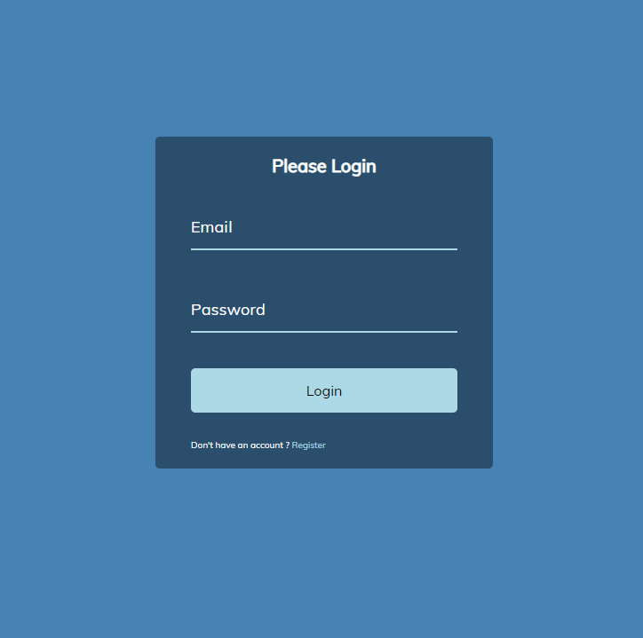

# From Wave Animation Clone Project

## 1. Project Description

Build a clone of a From Wave Animation using HTML, CSS and Javascript

## 2. Tech Stack
1. HTML
2. CSS
3. Javascript

## 3. Installing
1. Clone the repo
```
https://github.com/VoDuyThienVinh/FromWaveAnimation
```

2. Open Project Folder
3. Explore
4. Open index.html in Visual Studio Code, using Live Server
5. Enjoy :)

## 4.Screenshots



## 5. Link Github-Page
```
https://voduythienvinh.github.io/FromWaveAnimation/
```

## Adapted from:

Udemy Course: 50 Project in 50 Days - HTML, CSS & Javascript
Project Name: Day 8 - From Wave Animation
Create by: Brad Traversy, Florin Pop
Last updated 12/2020
URL: https://www.udemy.com/course/50-projects-50-days/
